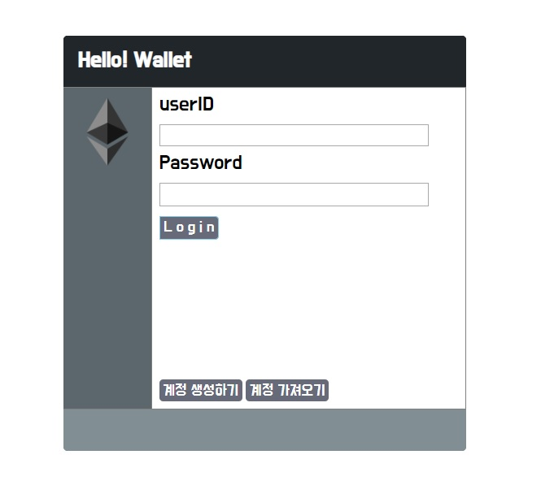
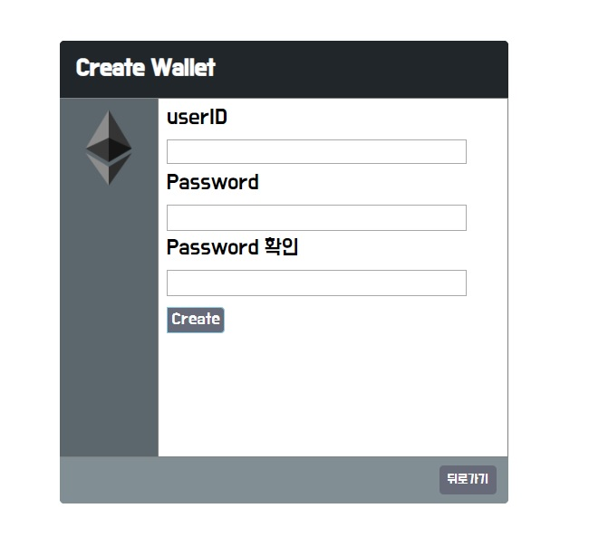
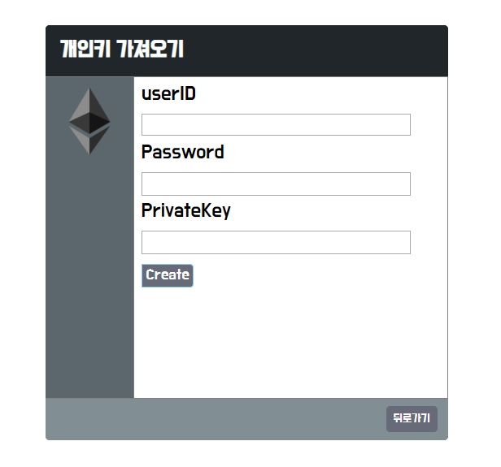
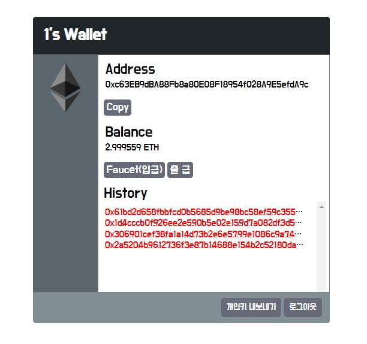
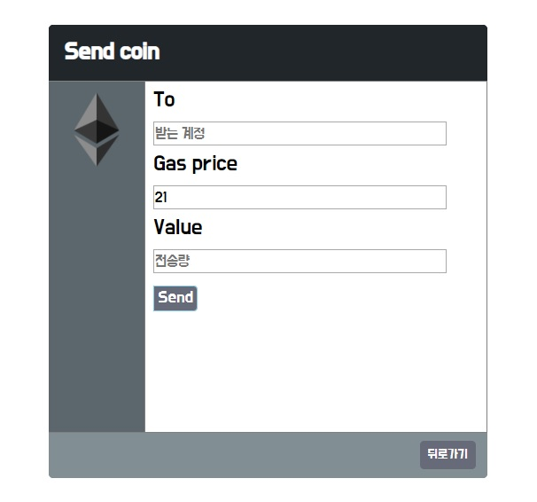
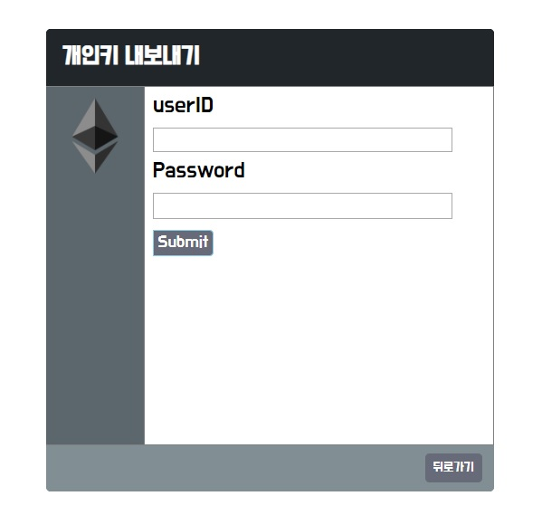
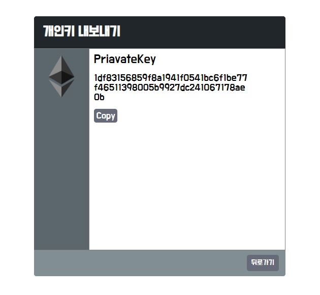

# Ewallet
### 0. 설치

- ##### git clone/npm install

```
$ git clone https://github.com/pilsa0327/ewallet.git
$ npm install
```


- #####  데이터베이스 설정

  - mysql database 및 table 생성 / 세션 확인

  - table 생성시 db.sql 파일 참고


### 1. 시작

```
$ npm run start   // node ./bin/www
$ npm run auto    // supervisor ./bin/www
```

`http://localhost:3000/` 접속

### 2. 기능

- ##### Index 페이지

  

  - ID / Password 를 통한 로그인 

  - 계정생성/ private키로 계정가져오기 페이지 이동

    

- ##### Create 페이지 

  

  - 계정 생성시 publickey 와 privatekey 생성후 index 페이지로 이동

    

  - 계정 생성시

    ```
    status {
      "200": () => alert('중복된 아이디가 존재합니다.'),
      "201": () => {alert('회원 가입되었습니다'), 
        window.location.href = `http://localhost:3000/`},
      "202": () => alert('비밀번호를 확인해주세요.')
    }
    ```

  

- ##### privatekey 페이지

  

  - privatekey로 계정 생성시

    ```
    status {
      //중복된 privatekey, id
       "200": () => alert("계정생성에 실패하셨습니다."),
       "202": () => {alert("회원 가입되었습니다."), 
         			 window.location.href = `http://localhost:3000/`}
    }
    ```

- ##### main 페이지

  

  - 로그인시 계정의 Address, balance(잔액), txHash History 값 출력

  - Faucet 버튼 클릭시 https://faucet.metamask.io/ 로 address값 요청 후

    txHash 값 반환(database에 저장) / 테스트 이더 입금

     

- ##### send 페이지

  

  - 전송시 

    ```
    status {
      "200": () => alert('잔액 부족 혹은 주소가 올바르지 않습니다.'),
      "201": () => window.location.href = 'http://localhost:3000/main'
    }
    ```

    

- exportPrivatekey 페이지

  

  

  - Id, password 입력시 privatekey 출력
 
    ```
    status {
      "200": () => alert("아이디 및 비밀번호를 다시 확인해주세요.")
      "201": () => //privatekey 출력
    }
    ```

### 3. 한계

- 전송 및 faucet page에서 발생한 txHash 값만을 데이터베이스에 저장하기 떄문에 외부지갑에서

  전송했을때 발생한 txHash 값은 데이터베이스에 저장이 안됨 

  -> History에 외부에서 발생한 txHash 값이 출력되지 않음.
